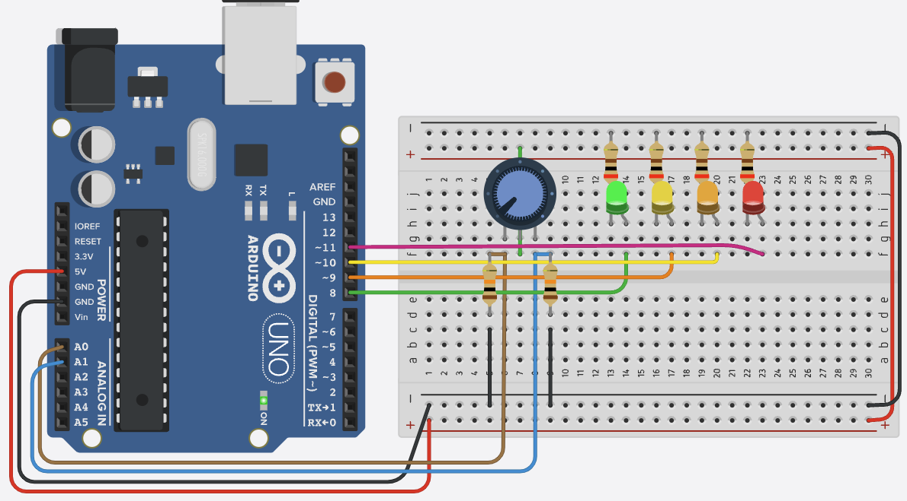

# Arduino Uno Analog Projects

This directory contains practical examples and projects demonstrating analog input/output capabilities of the Arduino Uno microcontroller.



## Scope
This repository focuses on:
- Analog input reading and processing
- PWM (Pulse Width Modulation) output generation
- Sensor interfacing and data acquisition
- Real-world applications and projects
- Best practices for analog signal handling

## Hardware Specifications

### Analog Input Pins (A0-A5)
- Resolution: 10-bit (0-1023)
- Input Range: 0-5V
- Sampling Rate: ~10,000 samples/second
- Input Impedance: 100MΩ

### PWM Output Pins (3,5,6,9,10,11)
- Resolution: 8-bit (0-255)
- Frequency: 
  - 490Hz (pins 5,6)
  - 980Hz (pins 3,9,10,11)
- Duty Cycle: 0-100%

## Project: Voltage Level Indicator (Analog_RW.ino)

### Overview
This project demonstrates reading analog voltage levels and displaying them using multiple LEDs as a visual indicator. The system reads voltage from an analog input and lights up different combinations of LEDs based on the voltage level.

### Hardware Requirements
- Arduino Uno
- 4 LEDs (Green, Orange, Yellow, Red)
- Analog voltage source (0-5V)
- Resistors (220Ω for LEDs)

### Pin Configuration
```cpp
#define ANL_IN     A0    // Analog input pin
#define LED_GREEN  8     // Green LED pin
#define LED_ORANGE 9     // Orange LED pin
#define LED_YELLOW 10    // Yellow LED pin
#define LED_RED    11    // Red LED pin
```

### Voltage Level Indicators
- > 4.00V: All LEDs ON
- > 3.00V: Orange, Yellow, Red LEDs ON
- > 2.00V: Yellow, Red LEDs ON
- > 1.00V: Red LED ON
- > 0.90V: All LEDs OFF

### Code Structure

#### Analog Value Reading
```cpp
float analog_value(int pin) {
  float analog_val = analogRead(pin);
  float analog_volt = (analog_val/1023)*5.0;
  return analog_volt;
}
```

#### LED Control Function
```cpp
void led_out(int G, int O, int Y, int R) {
  digitalWrite(LED_GREEN, G);
  digitalWrite(LED_ORANGE, O);
  digitalWrite(LED_YELLOW, Y);
  digitalWrite(LED_RED, R);
}
```

#### Voltage Level Detection
```cpp
void volt_step() {
  float analog_val_input = analog_value(ANL_IN);
  Serial.print(analog_val_input);
  
  if(analog_val_input > 4.00) {
    led_out(1,1,1,1);
  }
  else if(analog_val_input > 3.0) {
    led_out(0,1,1,1);
  }
  else if(analog_val_input > 2.0) {
    led_out(0,0,1,1);
  }
  else if(analog_val_input > 1.0) {
    led_out(0,0,0,1);
  }
  else if(analog_val_input > 0.9) {
    led_out(0,0,0,0);
  }
}
```

### Setup and Loop
```cpp
void setup() {
  Serial.begin(9600);
  pinMode(LED_BUILTIN, OUTPUT);
  pinMode(LED_GREEN, OUTPUT);
  pinMode(LED_ORANGE, OUTPUT);
  pinMode(LED_YELLOW, OUTPUT);
  pinMode(LED_RED, OUTPUT);
}

void loop() {
  volt_step();
  Serial.println();
  delay(100);
}
```

## Best Practices

### Signal Conditioning
- Use voltage dividers for >5V signals
- Implement RC filters for noise reduction
- Add protection circuits for sensitive inputs
- Consider signal amplification when needed

### Code Optimization
- Use appropriate sampling rates
- Implement proper error checking
- Add sensor calibration routines
- Optimize for power consumption

### Hardware Considerations
- Choose appropriate component values
- Consider power supply requirements
- Use proper grounding techniques
- Implement proper shielding when needed

## Project Structure
Each project in this directory includes:
- Circuit diagram
- Component list
- Code examples
- Calibration instructions
- Troubleshooting guide

## Getting Started
1. Review the circuit diagram
2. Gather required components
3. Build the circuit
4. Upload the code
5. Calibrate if necessary
6. Test and debug

## Notes
- Always check component datasheets
- Use appropriate voltage levels
- Implement proper error handling
- Consider environmental factors
- Document your modifications
- Test thoroughly before deployment

## Project Categories

### 1. Sensor Projects
- Temperature monitoring
- Light level detection
- Sound level measurement
- Pressure sensing
- Position sensing

### 2. Control Projects
- LED brightness control
- Motor speed control
- Servo position control
- Fan speed regulation
- Audio volume control

### 3. Measurement Projects
- Voltage measurement
- Current measurement
- Resistance measurement
- Capacitance measurement
- Frequency measurement

## Code Examples

### Basic Analog Read
```cpp
const int analogPin = A0;

void setup() {
  Serial.begin(9600);
}

void loop() {
  int sensorValue = analogRead(analogPin);
  float voltage = sensorValue * (5.0 / 1023.0);
  
  Serial.print("Sensor Value: ");
  Serial.print(sensorValue);
  Serial.print(" Voltage: ");
  Serial.println(voltage);
  
  delay(100);
}
```

### Basic PWM Output
```cpp
const int ledPin = 9;  // PWM pin

void setup() {
  pinMode(ledPin, OUTPUT);
}

void loop() {
  // Fade in
  for(int brightness = 0; brightness <= 255; brightness++) {
    analogWrite(ledPin, brightness);
    delay(5);
  }
  
  // Fade out
  for(int brightness = 255; brightness >= 0; brightness--) {
    analogWrite(ledPin, brightness);
    delay(5);
  }
}
```

## Common Analog Components

### Potentiometers
- **Types**: Linear, Logarithmic, Multi-turn
- **Values**: 1kΩ to 1MΩ
- **Applications**: Volume control, position sensing
- **Circuit**: Connect outer pins to 5V and GND, wiper to analog input

### Light Sensors (LDR)
- **Resistance Range**: 1kΩ (bright) to 1MΩ (dark)
- **Response Time**: ~100ms
- **Applications**: Light level detection, automatic lighting
- **Circuit**: Requires 10kΩ pull-down resistor

### Temperature Sensors
- **LM35**: 10mV/°C, -55°C to 150°C
- **TMP36**: 10mV/°C, -40°C to 125°C
- **Applications**: Temperature monitoring, climate control
- **Circuit**: Direct connection to analog input

### Analog Joysticks
- **Output**: Two analog values (X and Y)
- **Range**: 0-1023 for each axis
- **Applications**: Control systems, gaming
- **Circuit**: Requires pull-up resistors

### Pressure Sensors
- **Types**: Absolute, Gauge, Differential
- **Output**: 0.5V-4.5V (typical)
- **Applications**: Altitude, flow measurement
- **Circuit**: May require amplification

### Sound Sensors
- **Frequency Range**: 20Hz-20kHz
- **Sensitivity**: -38dB to -10dB
- **Applications**: Sound level monitoring, voice detection
- **Circuit**: Requires amplification and filtering

## Advanced Example: Temperature Sensor
```cpp
const int tempPin = A0;
const float tempCoefficient = 0.01;  // 10mV/°C

void setup() {
  Serial.begin(9600);
}

void loop() {
  int sensorValue = analogRead(tempPin);
  float voltage = sensorValue * (5.0 / 1023.0);
  float temperature = voltage / tempCoefficient;
  
  Serial.print("Temperature: ");
  Serial.print(temperature);
  Serial.println("°C");
  
  delay(1000);
}
```

## Projects
- Temperature Monitoring System
- Light Level Controller
- Analog Joystick Interface
- Sound Level Meter
- Pressure Monitoring System
- Potentiometer-based Control

## Notes
- Analog inputs use 10-bit resolution (0-1023)
- PWM outputs use 8-bit resolution (0-255)
- Use `map()` function to convert between ranges
- Consider using external ADC for higher resolution
- Add appropriate filtering for noisy signals
- Calibrate sensors for accurate readings
- Consider voltage dividers for >5V signals
- Use appropriate sampling rates
- Implement error checking
- Consider power consumption
- Add signal conditioning when needed
- Use appropriate libraries for complex sensors 