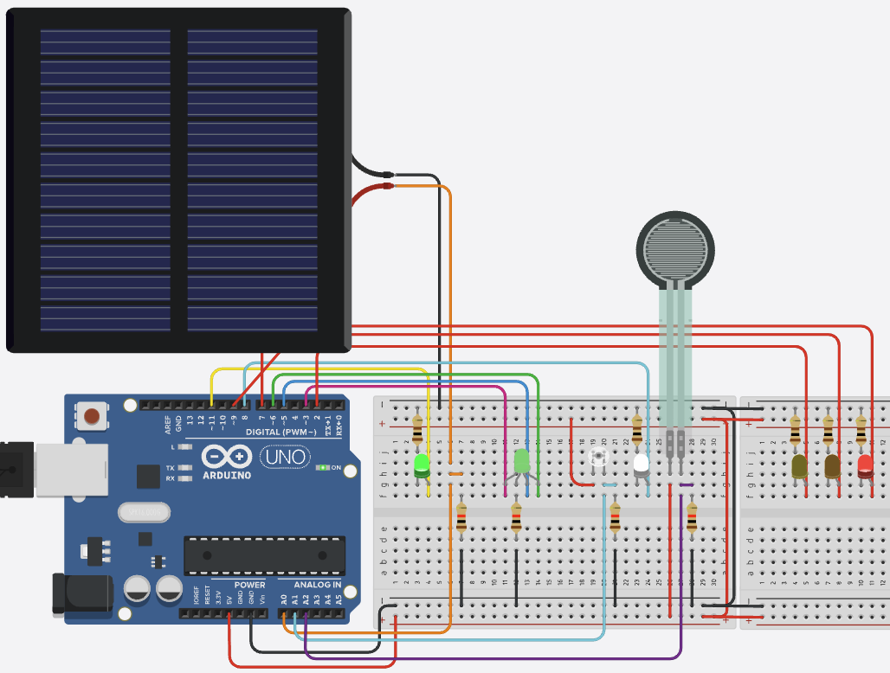

# Arduino Uno Analog & Digital Sensor Projects

This directory contains projects that demonstrate the use of both analog and digital sensors with Arduino Uno.



## Common Sensor Types

### Force Sensors
- **FSR (Force Sensitive Resistor)**
  - Analog output (0-1023)
  - Operating voltage: 3.3V-5V
  - Force range: 0.2N-20N
  - Applications: Pressure sensing, weight measurement
  - Circuit: Requires voltage divider (10kΩ resistor)

### Light Sensors
- **LDR (Light Dependent Resistor)**
  - Analog output (0-1023)
  - Operating voltage: 3.3V-5V
  - Response time: ~100ms
  - Applications: Light level detection, automatic lighting
  - Circuit: Requires voltage divider (10kΩ resistor)

### Solar Cells
- **Photovoltaic Cells**
  - Output: 0.5V-5V (depends on size)
  - Current: 20mA-100mA
  - Applications: Solar power, light energy harvesting
  - Circuit: Requires voltage divider and capacitor

## Sensor Interface Examples

### Force Sensor Read
```cpp
// Read force sensor value
const int forcePin = A0;
const int resistorValue = 10000;  // 10kΩ resistor

void setup() {
  Serial.begin(9600);
}

void loop() {
  int forceValue = analogRead(forcePin);
  float voltage = forceValue * (5.0 / 1023.0);
  float force = map(forceValue, 0, 1023, 0, 100);  // Map to percentage
  
  Serial.print("Force: ");
  Serial.print(force);
  Serial.println("%");
  delay(100);
}
```

### Light Sensor Read
```cpp
// Read light sensor value
const int lightPin = A1;

void setup() {
  Serial.begin(9600);
}

void loop() {
  int lightValue = analogRead(lightPin);
  float voltage = lightValue * (5.0 / 1023.0);
  float lightLevel = map(lightValue, 0, 1023, 0, 100);  // Map to percentage
  
  Serial.print("Light Level: ");
  Serial.print(lightLevel);
  Serial.println("%");
  delay(100);
}
```

### Solar Cell Read
```cpp
// Read solar cell value
const int solarPin = A2;
const int capacitorPin = 3;  // For charging capacitor

void setup() {
  pinMode(capacitorPin, OUTPUT);
  Serial.begin(9600);
}

void loop() {
  digitalWrite(capacitorPin, HIGH);  // Charge capacitor
  delay(100);  // Wait for charging
  
  int solarValue = analogRead(solarPin);
  float voltage = solarValue * (5.0 / 1023.0);
  
  Serial.print("Solar Voltage: ");
  Serial.print(voltage);
  Serial.println("V");
  
  digitalWrite(capacitorPin, LOW);  // Discharge capacitor
  delay(1000);
}
```

## Projects
- Force Sensor Projects
  - Weight measurement system
  - Pressure-sensitive control
  - Touch interface
- Light Sensor Projects
  - Automatic lighting control
  - Light level monitoring
  - Solar tracking system
- Solar Cell Projects
  - Solar power monitoring
  - Energy harvesting
  - Light intensity measurement

## Notes
- Always check sensor datasheet for voltage requirements
- Use appropriate voltage dividers for 5V sensors
- Consider using libraries for complex sensors
- Implement proper error checking
- Add calibration for analog sensors
- Use appropriate sampling rates
- Consider power consumption
- For force sensors:
  - Apply force gradually
  - Avoid exceeding maximum force
  - Calibrate for specific applications
- For light sensors:
  - Consider ambient light
  - Use appropriate filtering
  - Calibrate for specific light conditions
- For solar cells:
  - Match load impedance
  - Consider temperature effects
  - Use appropriate energy storage
  - Monitor maximum power point 