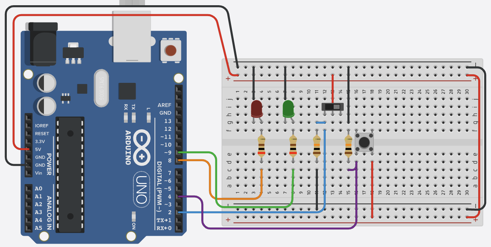

# Arduino Uno Digital Projects

This directory contains projects that demonstrate the use of digital inputs and outputs on the Arduino Uno.



## Digital Pins on Arduino Uno
- 14 digital pins (0-13)
- Each pin can be configured as INPUT or OUTPUT
- Pins 0-1 are used for Serial communication (RX/TX)
- Pins 2-13 can be used for general I/O
- Internal pull-up resistors available (20kΩ)

## Common Digital Components
- LEDs
- Push Buttons
- Toggle Switches
- Relays
- Digital Sensors
- LCD Displays
- 7-Segment Displays

## Basic Digital Read Example
```cpp
pinMode(2, INPUT_PULLUP);  // Configure pin 2 as input with pull-up
int buttonState = digitalRead(2);  // Read digital value from pin 2
```

## Basic Digital Write Example
```cpp
pinMode(13, OUTPUT);  // Configure pin 13 as output
digitalWrite(13, HIGH);  // Set pin 13 to HIGH (5V)
```

## Projects
- Coming soon...

## Notes
- Use INPUT_PULLUP for buttons to avoid external resistors
- Digital pins can source/sink up to 40mA
- Consider using transistors for higher current devices
- Use debouncing for mechanical switches 