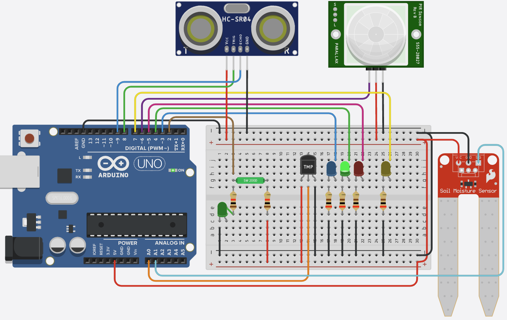

# 🤖 Arduino Uno Digital Sensor Project

This project demonstrates interfacing multiple digital and analog sensors with an Arduino Uno, including real-time monitoring and output using LEDs and serial communication.



## ✨ Features
- 🔄 Real-time monitoring of multiple sensors
- 🟢 Visual feedback with LEDs for temperature and motion
- 🖨️ Serial output for logging and debugging
- 🔗 Easy-to-expand modular design
- 🛡️ Robust error handling in code

## 📦 Components & Sensors
- 🟦 Arduino Uno
- 🟢 Tilt Sensor (Digital)
- 🌡️ Temperature Sensor (Analog)
- 🟫 Soil Moisture Sensor (Analog)
- 🟠 PIR Motion Sensor (Digital)
- 🟣 Ultrasonic Distance Sensor (HC-SR04)
- 🔵 LEDs (Blue, Green, Red)
- 🟤 Resistors
- 🟩 Breadboard & Jumper Wires

## 🖼️ Wiring Diagram Explanation
- All sensors and LEDs are connected to the Arduino as shown above.
- **Power Rails:** Red wires for 5V, black for GND.
- **Signal Wires:** Colored wires connect each sensor to its respective pin (see table below).
- **Breadboard:** Used for easy prototyping and connecting multiple components.

## 🔌 Pin Configuration
| Sensor/Component         | Arduino Pin |
|-------------------------|-------------|
| Tilt Sensor             | 2           |
| Temperature Sensor      | A0          |
| Temp Blue LED           | 3           |
| Temp Green LED          | 4           |
| Temp Red LED            | 5           |
| Soil Moisture Sensor    | A1          |
| PIR Motion Sensor       | 6           |
| PIR LED                 | 7           |
| Ultrasonic Trig (SR04)  | 8           |
| Ultrasonic Echo (SR04)  | 9           |

## 📝 Code Overview
The main logic is implemented in [`Digital_Sensor.ino`](Digital_Sensor.ino):
- **tiltSensor()**: Reads the tilt sensor (digital input)
- **tempSensor()**: Reads and maps temperature, controls LEDs by range
- **soilSensor()**: Reads and maps soil moisture value
- **pirSensor()**: Reads PIR sensor and controls PIR LED
- **sr04Sensor()**: Measures distance using the ultrasonic sensor
- **loop()**: Prints all sensor values to Serial in real time

### 💡 Example Output
```
1 | 23 | 45 | 0 | 120
0 | 18 | 60 | 1 | 98
...
```
Format: `Tilt | Temp | Soil | PIR | Distance(cm)`

## 🧪 Sensor Calibration Tips
- 🌡️ **Temperature Sensor:** Adjust the `map()` range in code for your sensor's datasheet.
- 🟫 **Soil Moisture Sensor:** Test in dry and wet soil, note analog values, and adjust mapping accordingly.
- 🟠 **PIR Sensor:** Allow a few seconds after power-up for stabilization.
- 🟣 **Ultrasonic Sensor:** Ensure clear path for accurate distance; test with known distances.

## 🛠️ Troubleshooting
- 🔌 **No Serial Output:** Check baud rate and COM port in Arduino IDE.
- 💡 **LEDs Not Lighting:** Verify wiring and pin numbers; check for correct resistor values.
- 📉 **Strange Sensor Values:** Double-check sensor power and ground connections.
- 🟦 **Arduino Not Detected:** Try a different USB cable or port.

## 🚀 Expansion Ideas
- Add more sensors (e.g., light, sound, gas)
- Log data to SD card or send to IoT cloud
- Add an LCD or OLED display for local readout
- Use relays or actuators for automation

## ⚡ Best Practices
- Double-check wiring before powering up
- Use appropriate resistor values for LEDs
- Calibrate sensors for your environment
- Use Serial Monitor (9600 baud) for real-time data
- Handle sensor values and edge cases in code

## 📝 Notes
- The code uses Arduino built-in functions (digitalRead, analogRead, map, etc.)
- Adjust mapping ranges in code for your specific sensors
- Ensure all sensors share a common ground
- For more details, see the comments in [`Digital_Sensor.ino`](Digital_Sensor.ino)

## 👤 Author & License
- Author: [Your Name]
- License: MIT 