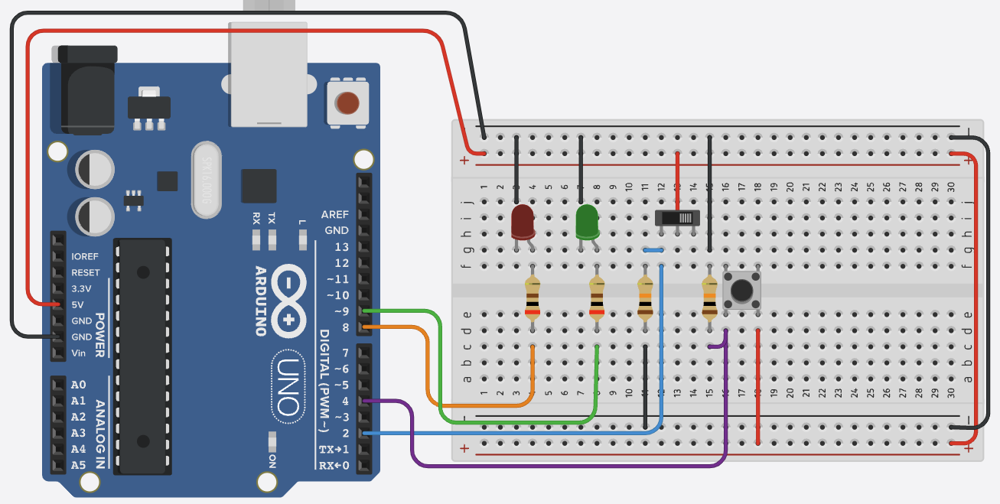

# LED, Button, and Switch Project

This project demonstrates the basic usage of LEDs, buttons, and switches with Arduino Uno.

## Circuit Diagram

## Components Required
- Arduino Uno
- LED (any color)
- Push Button
- Toggle Switch
- 220Ω Resistor (for LED)
- 10kΩ Resistor (for button)
- Breadboard
- Jumper Wires

## Features
- LED control using digital output
- Button input with debouncing
- Switch input for state control
- Serial monitor feedback

## Code Structure
- `led_btn_sw.ino`: Main Arduino sketch
  - LED control functions
  - Button debouncing
  - Switch state reading
  - Serial communication

## Usage
1. Connect the components as shown in the circuit diagram
2. Upload the code to Arduino Uno
3. Open Serial Monitor (9600 baud)
4. Press the button to toggle LED
5. Use the switch to change LED behavior

## Notes
- Button debouncing is implemented to prevent false triggers
- Serial monitor provides real-time feedback
- LED brightness can be adjusted using PWM (if using PWM pin) 