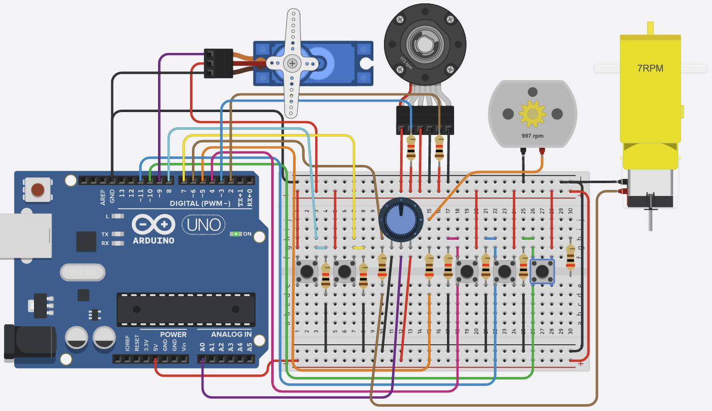

# ⚙️ Arduino Uno Motor Control Project

This project demonstrates how to control DC motors, a gear motor, and a servo motor using an Arduino Uno. It features manual and automatic control, encoder feedback, and real-time monitoring via serial output.

## ✨ Features
- 🕹️ Manual and automatic motor control
- 🔄 Real-time encoder position feedback
- ⚡ Variable speed control for gear motor
- 🔄 Servo positioning (left, right, center)
- 🖨️ Serial output for monitoring and debugging
- 🛡️ Safe operation with recommended best practices

## 📦 Components
- 🟦 Arduino Uno
- ⚡ DC Motor
- ⚙️ Gear Motor (with analog speed control)
- 🔄 Servo Motor
- 🟧 Motor Driver (e.g., L298N, L293D, or similar)
- 🟢 Push Buttons / Switches (for servo and DC motor control)
- 🟤 Resistors (for button debouncing)
- 🟩 Breadboard & Jumper Wires
- 🔋 Power Supply (for motors, if required)
- 🧭 Rotary Encoder (for position feedback)

## 🖼️ Circuit Overview
- **DC Motor**: Controlled by three digital inputs (IN1, IN2, IN3) and one PWM output (OUT).
- **Gear Motor**: Speed set by analog input (potentiometer or sensor) and controlled via PWM.
- **Servo Motor**: Position set by two buttons (left/right), with a default center position.
- **Encoder**: Provides feedback on motor/gear position using interrupts.
- **All grounds must be connected together.**

## 🔌 Pin Configuration
| Function/Component   | Arduino Pin | Description                        |
|---------------------|-------------|------------------------------------|
| DC Motor IN1        | 4           | Digital input for speed control    |
| DC Motor IN2        | 11          | Digital input for speed control    |
| DC Motor IN3        | 10          | Digital input for speed control    |
| DC Motor PWM OUT    | 5           | PWM output to motor driver         |
| Gear Motor Analog   | A0          | Analog input (potentiometer)       |
| Gear Motor PWM OUT  | 6           | PWM output to gear motor           |
| Servo PWM OUT       | 9           | PWM output to servo                |
| Servo Left Button   | 8           | Digital input for left position    |
| Servo Right Button  | 7           | Digital input for right position   |
| Encoder A           | 2           | Interrupt input for encoder        |
| Encoder B           | 3           | Interrupt input for encoder        |

## 📝 Code Overview
- **dcMotor()**: Reads three digital inputs to set DC motor speed (low, medium, high).
- **gearMotor()**: Reads analog input and maps it to gear motor speed (0–255 PWM).
- **servoMoter()**: Controls servo position (left, right, center) via two buttons.
- **updateEncoder()**: Interrupt routine to track encoder position.
- **loop()**: Continuously prints encoder position, updates all motors, and reads controls.

### 💡 Example Usage
- **Servo Control**: Press left/right buttons to move servo; release to center.
- **DC Motor**: Use switches to set speed (low/medium/high).
- **Gear Motor**: Adjust potentiometer for variable speed.
- **Encoder**: Monitor position in Serial Monitor (9600 baud).

## 🧪 Tips & Calibration
- **Button Debouncing**: Use hardware (capacitors) or software (delay) to avoid false triggers.
- **Encoder**: Test direction and resolution; adjust code if needed.
- **Motor Power**: Use external supply for motors if they draw significant current.
- **Servo**: Ensure servo is powered adequately to avoid resets.

## 🛠️ Troubleshooting
- **No Motor Movement**: Check wiring, power supply, and driver connections.
- **Erratic Encoder Values**: Check for noise, use shielded cables, or add filtering.
- **Servo Jitter**: Use separate power supply for servo if needed.
- **Serial Output Issues**: Confirm baud rate and COM port in Arduino IDE.

## 🚀 Expansion Ideas
- Add more motors or different types (stepper, brushless)
- Integrate speed/position feedback for closed-loop control
- Add an LCD/OLED display for real-time feedback
- Implement wireless control (Bluetooth, WiFi)
- Log data to SD card or send to IoT cloud

## ⚡ Best Practices
- Double-check wiring before powering up
- Use appropriate driver for your motor type
- Provide sufficient power for motors
- Avoid running motors directly from Arduino 5V
- Use flyback diodes for protection (if not included in driver)
- Debounce buttons in hardware or software for reliability

## 📝 Notes
- Adjust pin numbers and logic in code for your specific hardware
- Ensure all grounds are connected
- For more details, see comments in [`Motor.ino`](Motor.ino)
